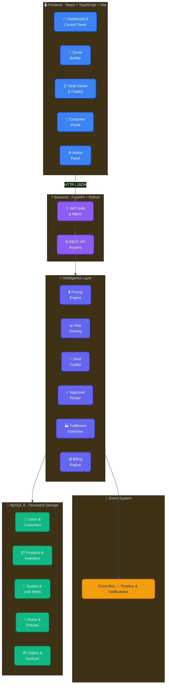
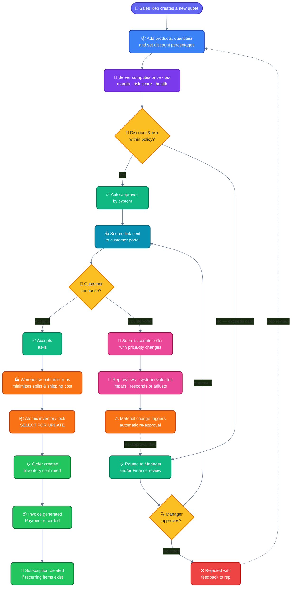

<!-- Gradient Header Banner -->
<p align="center">
  
</p>

<div align="center">

<!-- Animated Typing Tagline -->
<p align="center">
  <a href="#-how-dealflow360-works"></a>
</p>

<br />

<!-- One-liner Pitch -->
<p align="center">
  
  
  
  
  
  
</p>

<p align="center">
  <sub><b>Every deal follows one intelligent path — priced, risk-scored, approved, negotiated, fulfilled, and invoiced on a single screen.</b></sub>
</p>

<br />

<!-- Feature Highlight Cards -->
<table>
  <tr>
    <td align="center" width="25%">
      <br /><br />
      <b>Guided Workflow</b><br />
      <sub>1 Screen · 1 Action · 6 Steps<br />Always shows "What to do next"</sub>
    </td>
    <td align="center" width="25%">
      <br /><br />
      <b>Risk Engine</b><br />
      <sub>Weighted 0–100 Score<br />Explainable factor breakdown</sub>
    </td>
    <td align="center" width="25%">
      <br /><br />
      <b>Smart Fulfillment</b><br />
      <sub>Multi-warehouse optimizer<br />Minimizes splits & shipping cost</sub>
    </td>
    <td align="center" width="25%">
      <br /><br />
      <b>Data Firewall</b><br />
      <sub>Zero cost/margin leakage<br />Customer sees pricing only</sub>
    </td>
  </tr>
</table>

<br />

<!-- Technology Stack -->
<p align="center">
  <a href="https://react.dev"></a>
  <a href="https://www.typescriptlang.org"></a>
  <a href="https://vitejs.dev"></a>
  <a href="https://fastapi.tiangolo.com"></a>
  <a href="https://python.org"></a>
  <a href="https://www.mysql.com"></a>
</p>

<br />

</div>

---


## 📌 Project Overview

### The Problem

Sales teams waste hours juggling spreadsheets, email chains, and disconnected tools to close a single deal. Pricing errors leak margin. Approvals stall in inboxes. Customers wait days for a revised quote. No one has a clear picture of deal health until it's too late.

### Our Solution

DealFlow360 is a **self-governing sales operating system** that replaces fragmented tooling with one intelligent platform. It calculates pricing server-side, scores risk with explainable factors, routes approvals through configurable policy chains, optimizes multi-warehouse fulfillment, and gives customers a secure portal to negotiate — all within a guided 6-step workflow where every screen shows exactly **one action: what to do next.**

### Why It Matters

- 📉 **Margin erosion stops** — discount governance enforced by rules, not willpower
- ⏱️ **Deals close faster** — copilot guidance eliminates guesswork
- 🔒 **Zero data leakage** — customers never see costs, margins, or internal risk scores
- 🎯 **Full auditability** — every decision is tracked, explained, and reversible

---

## ✨ Key Features

| | Feature | What It Does |
|---|---------|-------------|
| 🧮 | **Smart Quoting** | Live server-side pricing with volume discounts, tax, and real-time margin calculations |
| 🛡️ | **Discount Governance** | Admin-configurable discount caps per product, tier, and category — stored in DB, not code |
| 📊 | **Risk Engine** | Weighted 0–100 risk score with explainable breakdown (margin, discount depth, credit tier) |
| ✅ | **Approval Routing** | Auto-approve within policy; escalate to Manager → Finance chains when thresholds are exceeded |
| 🤖 | **Deal Copilot** | Context-aware recommendations with projected financial impact and one-click optimizer |
| 🏭 | **Fulfillment Optimizer** | Multi-warehouse allocation minimizing split shipments and shipping costs |
| 🤝 | **Customer Portal** | Secure negotiation interface — customers see pricing only, never internal data |
| 💰 | **Billing Engine** | Hybrid one-time + subscription invoicing with payment tracking and proration |
| 📈 | **Control Tower** | Executive dashboard with pipeline metrics, margin trends, risk alerts, and activity feeds |
| 🔐 | **6-Role RBAC** | Sales Rep · Manager · Finance · Operations · Customer · Admin — each with scoped permissions |

---

## 🔄 How DealFlow360 Works

Every deal follows a clear, deterministic path from creation to close:

```mermaid
%%{init: {'theme': 'base', 'themeVariables': {'primaryColor': '#4F46E5', 'primaryTextColor': '#FFF', 'lineColor': '#94A3B8', 'fontSize': '14px'}}}%%

flowchart LR
    Q["🧮 QUOTE\nSelect products\nSet pricing & discounts"]:::blue
    A["✅ APPROVE\nRisk & margin check\nPolicy-based routing"]:::purple
    S["📤 SHARE\nSecure portal link\nCustomer-safe view"]:::cyan
    N["🤝 NEGOTIATE\nCounter-offers\nIntelligent responses"]:::pink
    F["🏭 FULFILL\nWarehouse optimization\nAtomic stock reservation"]:::orange
    C["💰 CLOSE\nOrder confirmation\nInvoice & subscription"]:::green

    Q ==> A ==> S ==> N ==> F ==> C

    classDef blue fill:#3B82F6,stroke:#1E40AF,stroke-width:2px,color:#FFF,rx:10
    classDef purple fill:#7C3AED,stroke:#5B21B6,stroke-width:2px,color:#FFF,rx:10
    classDef cyan fill:#0891B2,stroke:#155E75,stroke-width:2px,color:#FFF,rx:10
    classDef pink fill:#DB2777,stroke:#9D174D,stroke-width:2px,color:#FFF,rx:10
    classDef orange fill:#EA580C,stroke:#9A3412,stroke-width:2px,color:#FFF,rx:10
    classDef green fill:#16A34A,stroke:#166534,stroke-width:2px,color:#FFF,rx:10
```



> **One screen per step. One clear action. Zero guesswork.** The deal interface always shows where you are and what to do next.

---

## 🏗️ System Architecture



---

## ⚙️ Core Deal Workflow



---

## 🛠️ Technology Stack

| Layer | Technologies |
|-------|-------------|
| **Frontend** | React 18 · TypeScript · Vite · TanStack Query · React Router |
| **Backend** | FastAPI · Python 3.11+ · Pydantic · SQLAlchemy ORM · Alembic |
| **Database** | MySQL 8 (local, no cloud dependency) |
| **Auth** | JWT (HS256) · bcrypt password hashing · Role-Based Access Control |
| **Intelligence** | Deterministic risk scoring · Statistical anomaly detection · Rule-based copilot |
| **Testing** | Pytest unit tests · End-to-end demo scripts |

> 💡 **No Docker. No cloud. No external AI APIs.** Everything runs locally for full transparency and reproducibility.

---

## 💎 Why DealFlow360?

<table>
<tr>
<td width="50%">

### 🎯 What makes it different

- **Guided workflow** — one clear path, not a maze of tabs
- **Server-authoritative math** — pricing never computed client-side
- **Configurable governance** — rules live in the database, not code
- **Information firewalls** — customers never see internal data
- **Atomic operations** — stock, orders, and invoices created together or not at all

</td>
<td width="50%">

### 📊 What it delivers

- Sales reps close deals **faster** with copilot guidance
- Managers approve **confidently** with explainable risk scores
- Finance reviews **margin impact** before every sign-off
- Customers negotiate through a **clean, professional portal**
- Admins tune business rules **without touching code**

</td>
</tr>
</table>

---

## 🚀 Getting Started

### Prerequisites

- Python 3.11+ &nbsp;·&nbsp; Node.js 18+ &nbsp;·&nbsp; MySQL 8

### 1. Database Setup

```sql
CREATE DATABASE dealflow360 CHARACTER SET utf8mb4 COLLATE utf8mb4_unicode_ci;
```

### 2. Backend

```bash
cd backend
cp .env.example .env              # Edit with your MySQL credentials
python -m venv venv
venv\Scripts\activate              # Windows (or: source venv/bin/activate)
pip install -r requirements.txt
alembic upgrade head
python seed.py                     # Load demo data
uvicorn app.main:app --reload --port 8000
```

### 3. Frontend

```bash
cd frontend
cp .env.example .env              # Set VITE_API_BASE_URL=http://localhost:8000/api
npm install
npm run dev
```

### 4. Open the App

| URL | Purpose |
|-----|---------|
| http://localhost:5173 | Application |
| http://localhost:8000/docs | API Documentation (Swagger) |

### Demo Credentials

> Password for all accounts: **`Demo@123`**

| Account | Role | What to explore |
|---------|------|-----------------|
| `sales@demo.com` | Sales Rep | Create quotes, use copilot, submit for approval |
| `manager@demo.com` | Sales Manager | Approval inbox, risk review, team deals |
| `finance@demo.com` | Finance | Margin analysis, financial approvals, billing |
| `ops@demo.com` | Operations | Inventory, warehouses, fulfillment plans |
| `customer@acme.com` | Customer Portal | View shared quotes, submit counter-offers |
| `admin@demo.com` | Admin | Rules, settings, users, system configuration |

> 🎯 **Start here:** Open deal **Q-2026-0042** (Acme Corporation, Gold tier) to see the full 6-step workflow in action.

---

## 🔮 Future Scope

| Enhancement | Description |
|-------------|-------------|
| 🔄 **Real-time Sync** | Replace polling with WebSocket/SSE for instant deal state updates |
| 📄 **Document Generation** | Auto-generate quote PDFs with e-signature integration |
| 🧠 **ML Risk Model** | Train on historical deal data for predictive win-probability scoring |
| 🌍 **Multi-currency** | International deal support with live exchange rate conversion |
| 📱 **Mobile App** | React Native companion for on-the-go deal management |

---

<div align="center">

**Built for the hackathon. Designed for production.**

</div>
