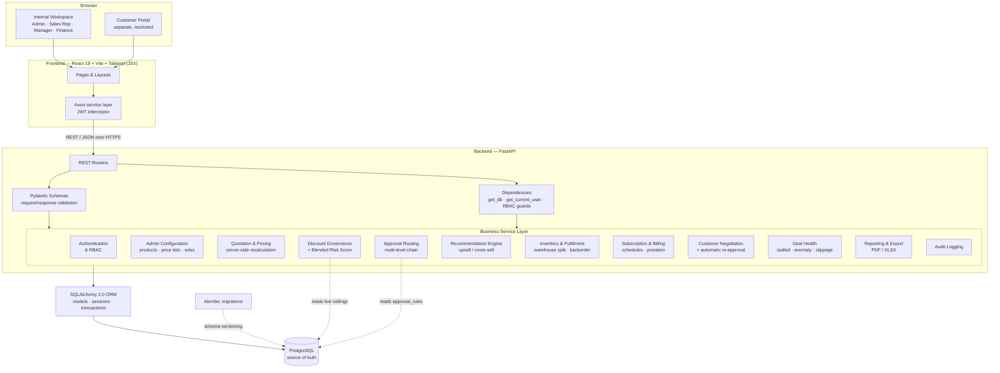
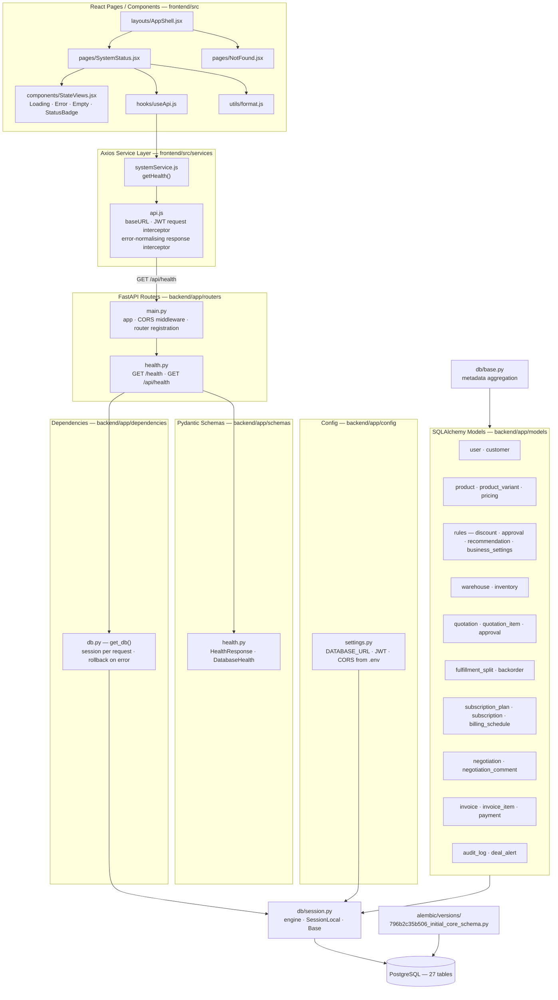
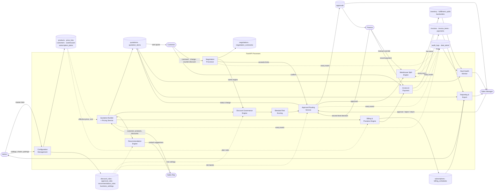
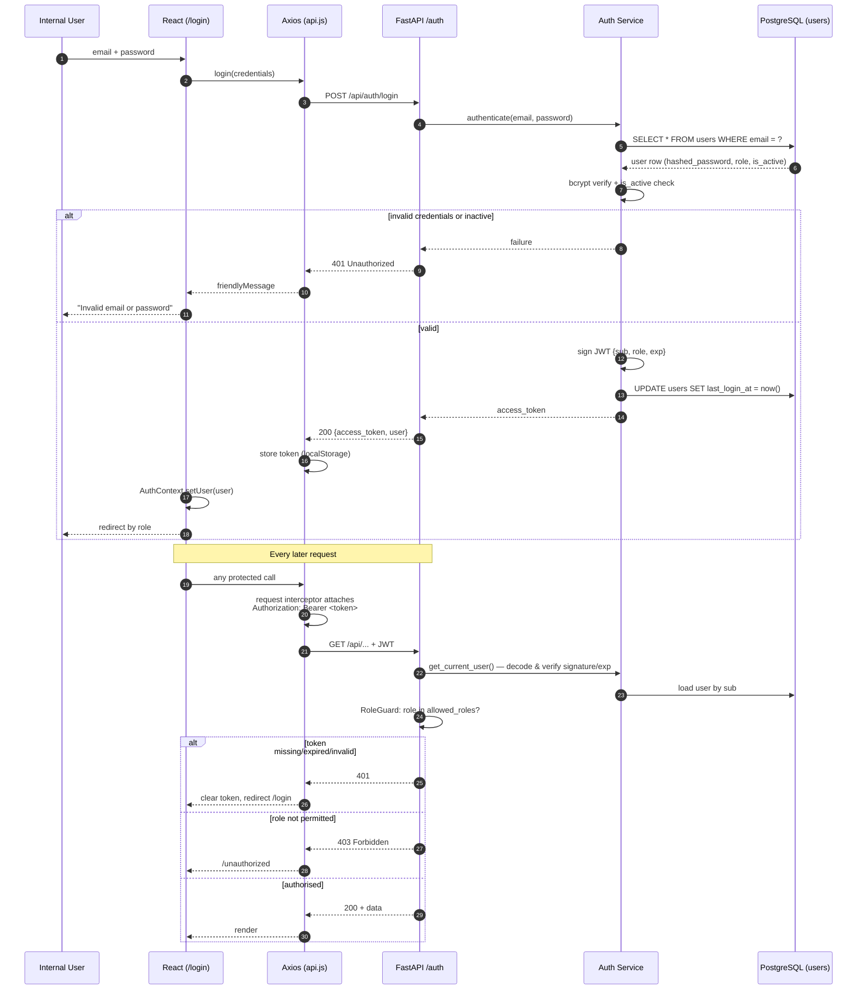
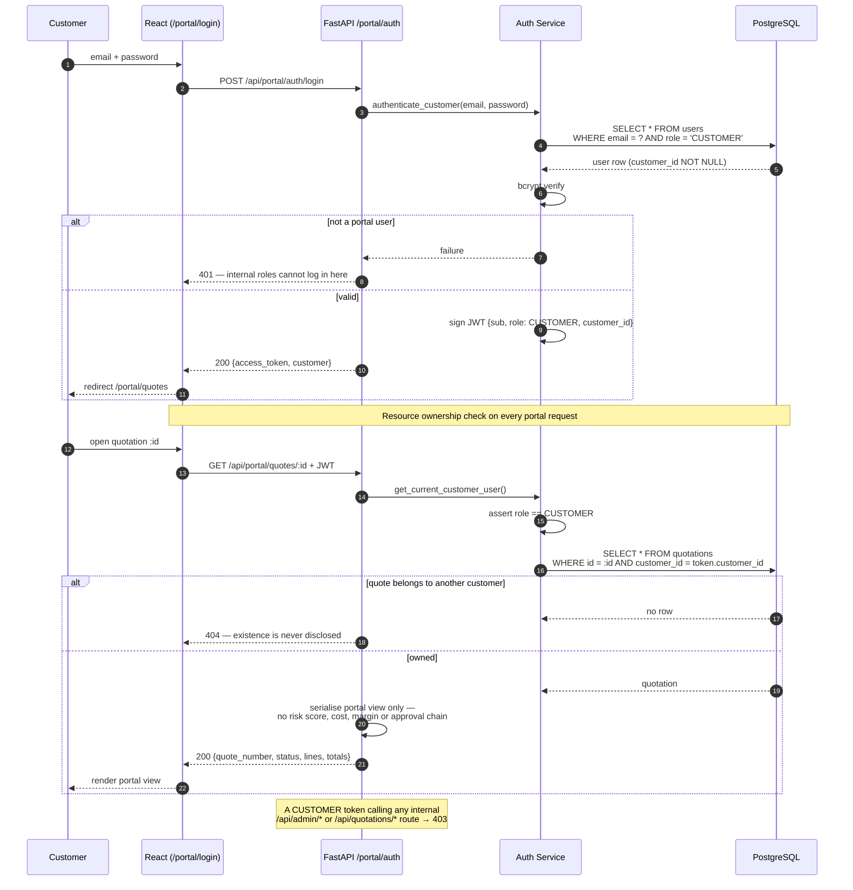

# DealFlow360

An intelligent, self-governing sales operations platform: quotation to cash, with
discount governance, automatic approval routing, multi-warehouse fulfilment,
hybrid billing and a real customer negotiation portal.

> **Source of truth:** `DealFlow360.pdf` (problem statement)
> **Build plan:** `implementation.txt` (60 steps across 20 phases)

---

## 1. Problem Statement

Most sales tools handle the basics — create a quote, confirm an order, invoice it.
Real B2B sales teams operate in messier conditions:

- Multi-level discount approvals, where different product categories carry
  different discretion limits.
- Partial stock spread across several warehouses.
- Bundled subscriptions mixed with one-time hardware on a single order.
- Customers who want to negotiate inside a portal instead of over email.
- Managers who only learn a deal is stuck after it has lost momentum.

DealFlow360 goes beyond a quote-to-invoice form and becomes a **self-governing
deal engine**: it enforces pricing discipline, reacts to inventory reality,
keeps subscriptions and one-time sales reconciled on one order, and gives both
reps and customers a living, negotiable document instead of a static PDF.

---

## 2. Tech Stack

| Layer | Technology |
| --- | --- |
| Frontend | React 19 + Vite, **JSX only**, Tailwind CSS, React Router, Axios |
| Backend | Python 3.12, FastAPI, Pydantic v2, SQLAlchemy 2.0 ORM |
| Database | **PostgreSQL** (single source of truth) |
| Migrations | Alembic |
| Auth | JWT (python-jose) + bcrypt password hashing (passlib) |

**Non-negotiable constraints:** no TypeScript, no TSX, no Express/Node backend,
no MongoDB. All core business logic (discount governance, blended risk,
approval routing, warehouse splitting, billing proration) lives in FastAPI
services and reads its configuration from PostgreSQL — never hardcoded, never
faked in React.

---

## 3. High-Level Design (HLD)



**Key architectural rule:** React never computes a price, discount ceiling,
risk score or margin that the user acts on. It renders what FastAPI returns.
Totals posted from the browser are recalculated server-side before persistence.

---

## 4. Low-Level Design (LLD)

The diagram below shows the request path as it is actually implemented.
Components in the dashed boxes are delivered in later phases; the solid path is
what exists today (Phase 1).



### Backend package layout

```
backend/
  app/
    config/settings.py        env-driven configuration (pydantic-settings)
    db/session.py             engine, SessionLocal, DeclarativeBase
    db/base.py                imports every model onto Base.metadata
    dependencies/db.py        get_db() request-scoped session
    models/                   27 ORM tables + enums + TimestampMixin
    schemas/                  Pydantic request/response contracts
    routers/                  REST endpoints
    services/                 business logic (Phase 2 onward)
    utils/
    main.py                   FastAPI app, CORS, router registration
  alembic/                    migration environment + versions
  tests/                      pytest smoke tests
  requirements.txt
  .env.example
```

### Frontend package layout

```
frontend/
  src/
    components/   reusable UI (tables, forms, modals, state views)
    pages/        route-level screens
    layouts/      AppShell + role layouts (Phase 2)
    services/     Axios instance + one module per API domain
    context/      auth context (Phase 2)
    hooks/        useApi and friends
    utils/        display formatting only
    App.jsx       router
    main.jsx      entry point
```

---

## 5. Data Flow Diagram



---

## 6. Authentication Flow Diagram

### 6.1 Internal users (Admin, Sales Rep, Sales Manager, Finance)



### 6.2 Customer portal users

The portal is a genuinely separate, restricted experience — not an internal
screen with a different label. A CUSTOMER token can only ever reach
`/api/portal/*`, and every portal query is filtered by the customer bound to
the token.



---

## 7. Database Overview

27 tables, all with `created_at` / `updated_at`, primary keys, foreign keys,
unique constraints, check constraints and indexes on every lookup and filter
column.

| Domain | Tables |
| --- | --- |
| Identity | `users` |
| Master data | `customers`, `products`, `product_variants`, `price_lists`, `price_list_items` |
| Business rules | `discount_rules`, `approval_rules`, `recommendation_rules`, `business_settings` |
| Inventory | `warehouses`, `inventory` |
| Deal | `quotations`, `quotation_items`, `approvals` |
| Fulfilment | `fulfillment_splits`, `backorders` |
| Recurring | `subscription_plans`, `subscriptions`, `billing_schedules` |
| Negotiation | `negotiations`, `negotiation_comments` |
| Billing | `invoices`, `invoice_items`, `payments` |
| Observability | `audit_logs`, `deal_alerts` |

A full ER diagram is added in Step 59 once the schema has settled.

**Design notes**

- `quotation_items` stores `requested_discount_percent`, `allowed_discount_percent`
  and `excess_discount_percent` side by side, so an approver can see *why* a
  line was flagged without re-running history.
- `approvals.cycle` increments each time a quote re-enters approval (for example
  after a customer counter-offer), preserving every round.
- `inventory` carries a check constraint `reserved_quantity <= available_quantity`,
  so an over-reservation fails at the database level, not just in application code.
- `business_settings` holds the tunable single values (risk band cut-offs,
  stalled-deal day count, anomaly multiplier) so changing behaviour never means
  changing code.

---

## 8. Setup Instructions

### 8.1 Prerequisites

- Python 3.12+
- Node.js 20+
- PostgreSQL 14+ running and reachable

### 8.2 PostgreSQL

```sql
CREATE DATABASE dealflow360;
```

Use any user with rights on that database — the connection string is the only
thing the app needs.

### 8.3 Backend

```bash
cd backend
python -m venv .venv
.venv\Scripts\activate          # Windows
# source .venv/bin/activate     # macOS / Linux

pip install -r requirements.txt

cp .env.example .env            # then edit DATABASE_URL
alembic upgrade head            # creates all 27 tables

uvicorn app.main:app --reload --port 8000
```

API docs: <http://127.0.0.1:8000/docs>
Health: <http://127.0.0.1:8000/api/health>

### 8.4 Frontend

```bash
cd frontend
npm install
npm run dev
```

App: <http://localhost:5173>

The Vite dev server proxies `/api` to `http://127.0.0.1:8000`, so the browser
stays on one origin during development. FastAPI still sends CORS headers for
deployments where the two are served separately.

### 8.5 Environment Variables

`backend/.env` (see `backend/.env.example`):

| Variable | Purpose |
| --- | --- |
| `DATABASE_URL` | PostgreSQL connection string — the only database |
| `SQL_ECHO` | Log every SQL statement (`true` / `false`) |
| `JWT_SECRET_KEY` | JWT signing secret — must be changed for any real deployment |
| `JWT_ALGORITHM` | Default `HS256` |
| `ACCESS_TOKEN_EXPIRE_MINUTES` | Token lifetime |
| `CORS_ORIGINS` | Comma-separated allowed origins |
| `APP_ENV` | `development` / `production` |

`frontend/.env` (optional, see `frontend/.env.example`):

| Variable | Purpose |
| --- | --- |
| `VITE_API_BASE_URL` | Absolute API base URL; leave unset to use the dev proxy |

Secrets are never committed — `.env` is git-ignored and `.env.example` carries
placeholders only.

---

## 9. User Roles

| Role | Scope |
| --- | --- |
| `ADMIN` | Products, customers, price lists, discount/approval/recommendation rules, warehouses, inventory, subscription plans, platform analytics |
| `SALES_REP` | Create and edit quotations, apply discounts, view recommendations, submit quotes, track approval and fulfilment, respond to negotiation |
| `SALES_MANAGER` | Review approvals — approve / reject / return for revision, deal health dashboard, audit history |
| `FINANCE` | Second-level approval, billing, subscription reconciliation, credits and refunds, fulfilment and backorder decisions |
| `CUSTOMER` | Portal only: view own quotations, comment, request changes, propose a counter discount, confirm |

Authorization is enforced by FastAPI dependencies on every route. Hiding a
button in React is presentation, never protection.

---

## 10. Business Logic

### Discount governance

Each quotation line is evaluated against **its own** ceiling:

```
effective_allowed_discount = min(customer_tier_ceiling, product_category_ceiling)
line_excess                = max(0, requested_discount - effective_allowed_discount)
```

Both ceilings are rows in `discount_rules`, read fresh from PostgreSQL on every
evaluation. Changing "Gold = 15%" to "Gold = 12%" in the Admin UI changes the
next calculation with no code change and no restart.

### Blended risk score

A single badly-over line, or many slightly-over lines, must both be caught. The
score aggregates the excess across the whole order rather than looking only at
the worst line, and its band cut-offs live in `business_settings`. The engine
returns an explainable result — `risk_score`, `risk_level`, `approval_required`,
`required_approval_chain`, `line_evaluations`, `reasons` — so the approval
screen can show the reasoning rather than a bare verdict.

> The PDF describes the *concept* of blending small violations but does not
> mandate one formula. The implementation therefore keeps the formula
> transparent and its thresholds configurable, and does not claim a specific
> formula is required by the specification.

### Approval routing

When a rep submits a quote, FastAPI loads the customer and tier, the line items,
the live discount rules and the approval rules; evaluates every line; computes
the blended risk; resolves the required chain; creates `approvals` rows; and
moves the quotation to `PENDING_APPROVAL`. **The rep never clicks "request
approval".** The same path runs again when a customer's counter-offer exceeds
the limits.

---

## 11. Testing

```bash
cd backend
.venv\Scripts\python -m pytest tests -v
```

The suite asserts the API contract and the ORM schema, and adapts to whether
PostgreSQL is reachable — a degraded backend is reported as `503 / degraded`,
never as a silent `200`.

---

## 12. Current Implementation Status

| Step | Description | Status |
| --- | --- | --- |
| 1 | Project setup — React/Vite/Tailwind/Router/Axios + FastAPI skeleton, CORS, env config, health endpoint | ✅ Done |
| 2 | PostgreSQL + SQLAlchemy engine, session, Base, `get_db`, Alembic, DB-verifying health check | ✅ Done |
| 3 | Core database schema — 27 tables with PKs, FKs, relationships, constraints, indexes, timestamps, enums | ✅ Done |
| 4–6 | Authentication & role-based access | ⬜ Not started |
| 7–9 | Admin master data (products, customers, price lists) | ⬜ Not started |
| 10–12 | Business rule configuration | ⬜ Not started |
| 13–15 | Sales workspace & quotation builder | ⬜ Not started |
| 16–18 | Discount engine & blended risk | ⬜ Not started |
| 19–21 | Approval workflow & audit trail | ⬜ Not started |
| 22–24 | Upsell & cross-sell | ⬜ Not started |
| 25–27 | Multi-warehouse fulfilment | ⬜ Not started |
| 28–30 | Hybrid billing & subscriptions | ⬜ Not started |
| 31–33 | Customer portal | ⬜ Not started |
| 34–36 | Negotiation & re-approval | ⬜ Not started |
| 37–39 | Invoicing & payment | ⬜ Not started |
| 40–42 | Deal health & anomaly monitoring | ⬜ Not started |
| 43–45 | Reporting & export | ⬜ Not started |
| 46–48 | Security, validation, transactions | ⬜ Not started |
| 49–53 | UI polish & end-to-end test | ⬜ Not started |
| 54–59 | Documentation & architecture | 🟡 HLD, LLD, DFD and Auth flow done; ER diagram pending Step 59 |

---

## 13. Future Roadmap

- Multi-currency and multi-company support (a bonus in the PDF, not a requirement).
- Recommendation ranking learned from actual co-purchase history in
  `quotation_items` rather than admin-defined pairings alone.
- Replacing the configurable anomaly rule with a trained model once enough
  quotation history exists.
- Webhook / email delivery of quotation links instead of in-app handoff only.
